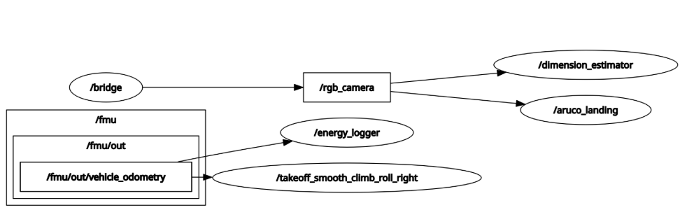
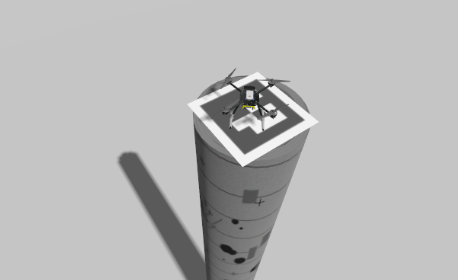

# **TerraDrop-PX4**  
### Autonomous Cylinder Search, Visual Analysis, and Precision Landing with ROS2, Gazebo, and PX4

TerraDrop-PX4 is a compact autonomous-drone micro-project built around a **repository-local ROS2 workspace**.  

- search for a cylindrical target.
- visually detect and analyze it.
- estimate relative geometry from onboard vision.
- perform controlled autonomous landing on the target.

The ROS2 package name: `terrain_mapping_drone_control`

while organizing the overall repository as:

```text
TerraDrop-PX4/
├── assets/
├── LICENSE
├── README.md
└── ws/
    ├── build/
    ├── install/
    ├── log/
    └── src/
        ├── px4_msgs/
        └── terrain_mapping_drone_control/
```

---

## Concept

The central idea behind TerraDrop-PX4 is to demonstrate a minimal but complete **vision-guided autonomous aerial task loop** inside simulation:

1. launch a PX4-powered drone in Gazebo.
2. bring it under ROS2 control.
3. use onboard RGB vision to detect a visual target.
4. estimate target-relative geometry using camera projection.
5. align the vehicle over the target.
6. command a safe landing sequence.

This makes the project a compact study in the intersection of:

- drone autonomy.
- perception-driven control.
- ROS2 node orchestration.
- PX4 offboard interfacing.
- simulated robotic exploration.

The implementation is intentionally focused and practical: one environment, one main target class, one clear terminal behavior.

## Mission Scope

TerraDrop-PX4 is scoped around the **main cylinder mission only**:

- autonomous takeoff.
- target search / visual acquisition.
- cylinder-related visual analysis.
- ArUco-guided alignment.
- autonomous landing on the target.

---

## System Overview

## Core Perception and Control Logic

### 1. Takeoff and Hover

The takeoff node is responsible for:

- arming the drone.
- enabling OFFBOARD mode.
- commanding a smooth ascent.
- holding position at the desired altitude.

This establishes a stable airborne state before visual guidance begins.

### 2. Visual Marker Detection

The landing pipeline relies on ArUco-based target recognition from the RGB camera stream. Once the marker is detected:

- the image-plane marker position is computed.
- pixel offsets from the desired image center are measured.
- corrective motion commands are generated.
- the drone converges over the target.
- landing is initiated once alignment is achieved.

This forms a lightweight visual-servoing loop.

### 3. Geometric Estimation

A companion estimator uses the observed pixel width of the marker and a known marker size to infer range using the pinhole camera model. This supports relative target analysis and can also be used to sanity-check perception performance.

## Mathematical Model

### Pinhole Projection Model

The distance estimator uses the standard pinhole-camera relationship between real-world object size and observed image size.

Let:

- $Z$ = distance from camera to marker.
- $f_x$ = focal length in pixels.
- $W$ = real marker width in meters.
- $w$ = observed marker width in pixels.

Then:

$$
Z = \frac{f_x \. W}{w}
$$

### Parameters Used in the Original Estimator

| Parameter | Value | Meaning |
| --- | --- | --- |
| `marker_real_size` | `0.2 m` | physical width of the ArUco marker |
| `fx` | `554.0 px` | camera focal length used by the estimator |

---

## Project Structure

The repository is organized around a **local ROS2 workspace**, with the main package located at:

`ws/src/terrain_mapping_drone_control/`

A representative structure is:

```text
TerraDrop-PX4/
├── assets/
│   ├── rqt_graph.png
│   ├── dimension_estimator_output.png
│   ├── final_result.png
│   ├── gazebo_view.png
│   └── mission_sequence.png
├── LICENSE
├── README.md
└── ws/
    ├── build/
    ├── install/
    ├── log/
    └── src/
        ├── px4_msgs/
        └── terrain_mapping_drone_control/
            ├── CMakeLists.txt
            ├── config/
            ├── launch/
            ├── models/
            ├── package.xml
            ├── resource/
            ├── scripts/
            ├── setup.py
            └── terrain_mapping_drone_control/
```

Per project policy:

- all ROS 2 builds happen from `TerraDrop-PX4/ws`.
- `build/`, `install/`, and `log/` are local artifacts and should remain gitignored.
- `PX4-Autopilot` stays outside the repository as an external local dependency.
- the ROS 2 package name is `terrain_mapping_drone_control`, the repository name is `TerraDrop-PX4`.

## Environment

Target environment:

- **Pop!_OS 24.04 (Ubuntu 24.04 based)**
- **Wayland session**
- **ROS2**
- **Gazebo**
- **PX4 SITL**

### Qt / Wayland Compatibility

For Gazebo, RViz, and related Qt-based tools on user's machine (Pop!\_OS 24.04 LTS), use:

```bash
export QT_QPA_PLATFORM=xcb
```

This was an explicit environment rule for author's implementation.

## Dependencies

This project assumes the following major components are available:

- ROS2.
- PX4 SITL.
- Gazebo.
- Micro XRCE-DDS Agent.
- OpenCV.
- `px4_msgs`.
- project package: `terrain_mapping_drone_control`.

## Build Workflow

From the repository-local workspace:

```bash
cd ~/GitHub/TerraDrop-PX4/ws
colcon build --symlink-install
source install/setup.bash
```

## PX4 Model Deployment

This project keeps PX4 external to the repository.  
Before running the mission, we deploy the custom model files from the package into the local PX4 tree.

Example:

```bash
cd ~/GitHub/TerraDrop-PX4/ws/src/terrain_mapping_drone_control
chmod +x scripts/deploy_px4_model.sh
./scripts/deploy_px4_model.sh -p ~/PX4-Autopilot
```

This mirrors the intended local dependency workflow for the project.

## Launch Procedure

### 1. Start the simulation

```bash
ros2 launch terrain_mapping_drone_control cylinder_landing.launch.py
```

### 2. Start the PX4 communication agent

```bash
MicroXRCEAgent udp4 -p 8888
```

This establishes DDS communication between PX4 and the ROS2 side of the system.

### 3. Run the takeoff node

```bash
ros2 run terrain_mapping_drone_control takeoff.py
```

This:

- arms the drone.
- switches it into OFFBOARD mode.
- performs ascent and maintains hover.

### 4. Run the visual landing node

```bash
ros2 run terrain_mapping_drone_control aruco_landing.py
```

This node:

- subscribes to camera input.
- detects the ArUco target.
- aligns the drone over the marker.
- initiates landing once centered.

### 5. Run the distance estimator

```bash
ros2 run terrain_mapping_drone_control dimension_estimator.py
```

This computes marker distance from image geometry using the pinhole model.

> Ensure the drone is airborne and the target marker is visible before using the distance estimator node.

## ROS2 Topics and Control Flow

At a high level, the project uses the following pattern:

- visual data arrives from the RGB camera stream.
- marker geometry is extracted in image space.
- motion commands are generated for alignment.
- PX4 receives offboard trajectory or control inputs.
- once the marker is centered, landing is commanded.

`/fmu/in/trajectory_setpoint`

while the landing node uses vision feedback and alignment logic prior to landing.

## Visual Results

### ROS Graph

`assets/rqt.png`



### Final Result

Place the final landing result image here:

`assets/final_result.png`



### Created Assets

- `assets/final_Result.png`
- `assets/rqt.png`

## Node-by-Node Summary

### `takeoff.py`

- automatically arms the drone.
- switches to OFFBOARD mode.
- ascends to target altitude and maintains hover.
- publishes trajectory setpoints for vehicle control.

### `aruco_landing.py`

- subscribes to the RGB camera feed, detects ArUco markers in real time.
- computes alignment corrections from image-plane offsets.
- initiates landing when alignment is satisfactory.

### `dimension_estimator.py`

- measures marker width in the image and uses known marker size and camera focal length.
- computes relative distance using pinhole projection.
- supports geometric validation of the perception pipeline.

## Why This Project Matters

TerraDrop-PX4 is small in scale, but it packs several important robotics ideas into one pipeline:

- offboard UAV control.
- perception-driven autonomy.
- camera-geometry-based measurement.
- target-relative navigation.
- simulation-first validation.

It demonstrates that a robotic system can move from **raw sensor observation** to **closed-loop task completion**.

## Limitations and Extension Paths

Current scope is intentionally narrow:

- simulation-focused.
- target-specific.
- marker-assisted landing.
- limited public mission scope.

## Repository Notes

- Repo name: `TerraDrop-PX4`.
- ROS2 package name: `terrain_mapping_drone_control`.
- PX4 remains external to the repository.
- all builds should be performed from `ws/`.
- screenshots and media belong in `assets/`.

This keeps the project reproducible, cleanly organized, and aligned with the intended workspace-local development model.

## Academic Context & Acknowledgment

This micro-project was completed as part of:

**SES 598: Space Robotics & AI**  
Arizona State University  

**Instructor:** Prof. Jnaneshwar Das  
**GitHub:** https://github.com/darknight-007  

The course is affiliated with the  
**Distributed Robotic Exploration and Mapping Systems (DREAMS) Laboratory**  
**GitHub:** https://github.com/DREAMS-lab  
**Website:** https://deepgis.org/dreamslab  

The assignment/micro-project structure, evaluation methodology, and coverage-control framework were inspired by course material and lab research themes in autonomous systems and robotic exploration.

---
